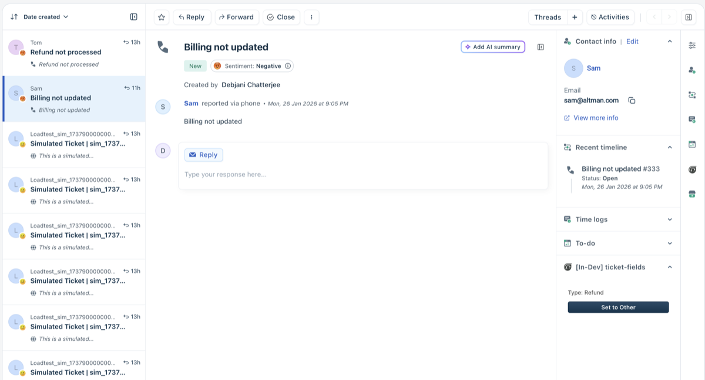

Ticket Fields Manager: Dynamic UI & Logic Orchestration
=======================================================

A robust Freshworks app demonstrating real-time ticket field manipulation and dual-location synchronization. It leverages **Ticket Background** for silent business logic (auto-hiding Internal Notes) and **Ticket Sidebar** for interactive UI, utilizing the **Platform v3 Event Bus** to maintain state consistency across page refreshes.

## Screenshots

<table>
<tr>
<td width="50%">

**Before:** Ticket with Internal Notes hidden (Refund ticket type)



</td>
<td width="50%">

**After:** Ticket with Internal Notes visible (Other ticket type)


</td>
</tr>
</table>


* * * * *

📋 Table of Contents
--------------------

-   [Overview](https://www.google.com/search?q=%23ticket-fields-manager-dynamic-ui--logic-orchestration)

-   [Key Features](https://www.google.com/search?q=%23-key-features)

-   [Architecture: Dual-Location Sync](https://www.google.com/search?q=%23-architecture-dual-location-sync)

-   [Feature to Implementation Mapping](https://www.google.com/search?q=%23-feature-to-implementation-mapping)

-   [Project Structure](https://www.google.com/search?q=%23-project-structure)

-   [Setup Guide](https://www.google.com/search?q=%23-setup-guide)

-   [Troubleshooting](https://www.google.com/search?q=%23-troubleshooting)

-   [Resources](https://www.google.com/search?q=%23-resources)

* * * * *

🚀 Key Features
---------------

### 1\. Conditional Field Visibility

Automatically toggles the visibility of the "Internal Notes" field based on the ticket category. This reduces **Agent Cognitive Load** by removing irrelevant fields for specific workflows (e.g., Refund requests).

### 2\. Automated Attribute Enforcement

Leverages the **Data Methods API** to automatically escalate ticket priority to "High" when a "Refund" type is detected, ensuring critical tickets meet SLA requirements without manual intervention.

### 3\. Reactive UI Synchronization

The Sidebar and Background locations communicate via **Data Events**. When a user toggles the ticket type in the sidebar, the background script instantly reacts to modify the field visibility in real-time.

* * * * *

🏗 Architecture: Dual-Location Sync
-----------------------------------

The app employs a "Headless Logic + Interactive UI" pattern to ensure business rules are enforced even if the sidebar is closed.

### 1\. Headless Logic (Background)

-   **Flow**: Handled via `ticket_background.html` and `app.js`.

-   **Engineering Rationale**: By placing visibility logic in the background, the app ensures that field-level security and UI rules are applied immediately upon ticket load, independent of the sidebar's lifecycle.

### 2\. State-Aware UI (Sidebar)

-   **Flow**: Handled via `index.html` and `sidebar.js`.

-   **Engineering Rationale**: Provides a dedicated control point for agents. It subscribes to `ticket.typeChanged` events to remain a "source of truth" for the current ticket state.

* * * * *

🔗 Feature to Implementation Mapping
------------------------------------

| **Functionality** | **Platform Module** | **Path** | **Engineering Rationale** |
| --- | --- | --- | --- |
| **Field Hiding** | Interface API | `app/scripts/app.js` | Uses `client.interface.trigger("hide", ...)` for dynamic UI control. |
| **Type Management** | Data Methods | `app/scripts/sidebar.js` | Uses `client.data.set("ticket", ...)` to persist changes to the database. |
| **Event Monitoring** | App Events | `app/scripts/app.js` | Listens to `ticket.typeChanged` for reactive, zero-polling updates. |
| **UI Interaction** | Ticket Sidebar | `app/index.html` | Provides a manual override for ticket types within the native sidebar. |

* * * * *

📂 Project Structure
--------------------

Plaintext

```
.
├── app/                        # Frontend Assets
│   ├── index.html              # Sidebar UI Entry Point
│   ├── ticket_background.html  # Background Logic Entry Point
│   ├── scripts/
│   │   ├── app.js              # Background Logic (Field Visibility)
│   │   └── sidebar.js          # Sidebar Logic (UI & State Toggling)
│   └── styles/
│       └── style.css           # Minimal sidebar styling
├── config/                     # Configuration
│   └── iparams.json            # Installation Parameters
├── manifest.json               # Location & Permission Definitions
└── README.md                   # Documentation

```

* * * * *

🛠 Setup Guide
--------------

### 1\. Prerequisites

-   **Freshworks CLI (FDK)**: Installed and authenticated.

-   **Node.js**: Version 18.20.8 (LTS).

-   **Freshdesk Account**: Admin access for testing custom apps.

### 2\. Configuration

-   **Installation Parameters**: Open `http://localhost:10001/custom_configs` to set any required local parameters.

-   **Ticket Fields**: Ensure your Freshdesk instance has a field named `Internal Notes` (system name: `internal_note`).

### 3\. Installation

1.  **Run Locally**:

    Bash

    ```
    fdk run

    ```

2.  **Verify**: Log into Freshdesk, open a ticket, and append `?dev=true` to the URL.

3.  **Test**: Change the ticket type to "Refund" and observe the Internal Notes field disappearing instantly.

* * * * *

⚠️ Troubleshooting
------------------

| **Error Code / Symptom** | **Common Cause** | **Resolution** |
| --- | --- | --- |
| **Field doesn't hide** | Async loading race condition | The app includes a 200ms delay; ensure the field ID matches your instance. |
| **Type not persisting** | Missing API Permissions | Check `manifest.json` to ensure `ticket` data methods are authorized. |
| **Sidebar is blank** | Stylesheet or Script error | Check the browser console (Inspect Element) for local file path errors. |

* * * * *

📚 Resources
------------

-   [Freshworks Interface API Docs](https://developers.freshworks.com/docs/apps/v3/app-locations/ticket-sidebar/%23interface-api)

-   [Data Methods Documentation](https://developers.freshworks.com/docs/apps/v3/app-locations/ticket-sidebar/%23data-api)

-   [Sample App Gallery](https://github.com/freshworks-developers)

* * * * *
