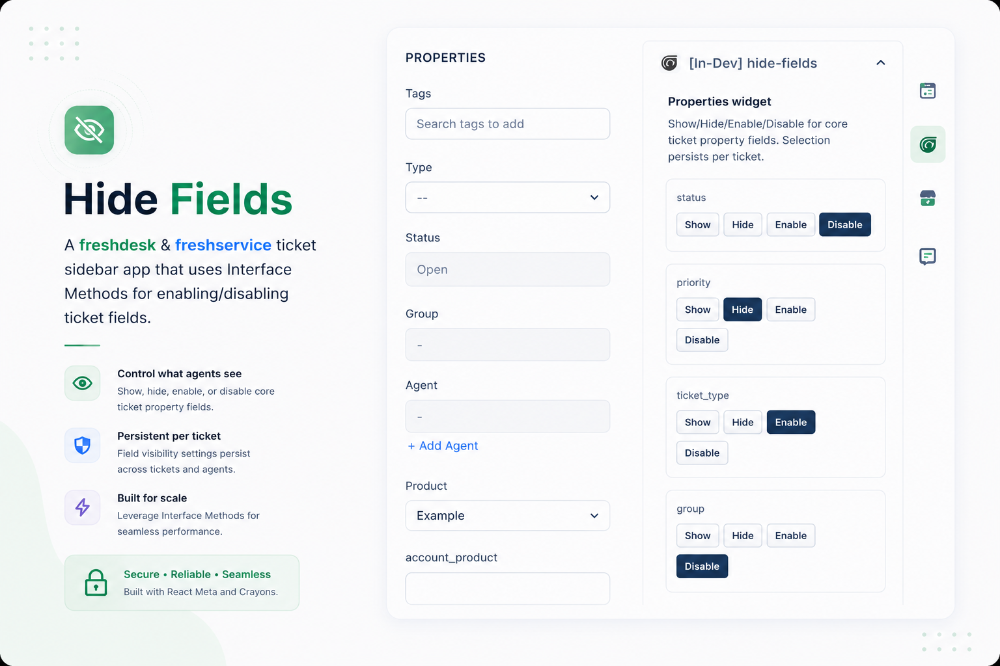

<p align="center">
  
</p>

# Hide Fields

A Freshworks Platform 3.0 **React Meta** sample app that demonstrates conditional ticket field visibility using **Interface Methods**, **Data Methods**, and dual-location synchronization between **ticket background** and **ticket sidebar**.

## Description

Refund workflows often need a streamlined ticket view — high priority, no internal notes clutter. Hide Fields automates that behavior in the background while the sidebar provides an interactive **Properties widget** playground for `hide`, `show`, `enable`, and `disable`, with per-ticket persistence.

### Core Functionality

1. **Automatic field rules (background)** — when ticket type is Refund, set priority to High and hide Internal Notes; show notes for all other types.
2. **Properties widget controls (sidebar)** — Show/Hide/Enable/Disable for `status`, `priority`, `ticket_type`, `group`, `product`, and `tag` with persisted button selection per ticket.

## User Interfaces

| Surface | Placement | Behavior |
| --- | --- | --- |
| `app/ticket_background.html` | `support_ticket.ticket_background` | Headless logic: hide/show `note`, set `priority` on Refund |
| `app/ticketSidebar.html` | `support_ticket.ticket_sidebar` | React sidebar: Properties widget Show/Hide/Enable/Disable with persisted selection |

## Platform 3.0 Features Used

### 1. Interface Methods — Field Visibility

Background and sidebar call `client.interface.trigger()` with actions `hide`, `show`, `enable`, and `disable`:

```javascript
await client.interface.trigger('hide', { id: 'note' });
await client.interface.trigger('show', { id: 'status' });
await client.interface.trigger('disable', { id: 'priority' });
```

The sidebar persists each field’s last selected action per ticket in `localStorage`. On refresh, it re-applies saved actions silently and highlights the selected button.

### 2. Data Methods — Ticket Context

Both locations read ticket type with `client.data.get('ticket')`. The sidebar writes type changes with `setValue` on `ticket_type`.

### 3. App Events — Dual-Location Sync

The background script listens to `app.activated`, `ticket.updated`, `ticket.typeChanged`, and `ticket.propertiesLoaded`. When the sidebar toggles type, the background applies field rules without polling.

### 4. Crayons UI Components

| Component | Usage |
| --- | --- |
| `<fw-button>` | Show/Hide/Enable/Disable actions with primary color for the active selection |
| `<fw-spinner>` | Loading state before catalog renders |

## Project Structure

```
├── app/
│   ├── ticketSidebar.html      # Ticket sidebar shell (React Meta entry)
│   ├── ticket_background.html  # Background entry (headless logic)
│   ├── scripts/
│   │   └── app.js              # Background hide/show and priority rules
│   ├── components/
│   │   ├── bootstrap/
│   │   │   └── crayonsInit.js   # Crayons loader + CSS
│   │   └── placeholders/
│   │       ├── PlaceholderWrapper.jsx
│   │       ├── ticketSidebar.jsx
│   │       └── TicketSidebarApp.jsx
│   └── styles/
│       ├── style.css
│       └── images/
│           └── icon.svg
├── config/
│   └── iparams.json
├── tests/
│   └── app.test.js
├── manifest.json
├── package.json
├── usecase.md
└── vitest.config.js
```

## Prerequisites

- [Freshworks CLI (FDK)](https://developers.freshworks.com/docs/app-sdk/v3.0/support_ticket/basic-dev-tools/freshworks-cli/) v10.1.2 or later
- Node.js v24.x
- A Freshdesk trial account with ticket types including **Refund** and **Other**

Enable global apps before local development:

```bash
fdk config set global_apps.enabled true
```

## Local Development

1. Clone the repository and enter the app directory:
   ```bash
   git clone <repo-url>
   cd hide-fields
   ```
2. Install dependencies and validate:
   ```bash
   npm install
   fdk validate
   ```
3. Run the app locally:
   ```bash
   fdk run
   ```
4. Open a Freshdesk ticket with `?dev=true`:
   ```
   https://your-domain.freshdesk.com/a/tickets/1?dev=true
   ```
5. Test the workflow:
   - Set ticket type to **Refund** in the native properties panel — Internal Notes should hide and priority should become High.
   - In the sidebar, click **Hide** on a property field — the button stays highlighted and the choice persists when you refresh the ticket.

## Testing

```bash
npm test
```

## Key Learnings

1. **Background + sidebar** — put enforcement logic in `ticket_background` so rules apply even when the sidebar is closed; use the sidebar for agent controls and method exploration.
2. **React Meta for sidebars** — React Meta apps can ship multiple UI surfaces while keeping Platform 3.0 initialization (`app.initialized()`) and lifecycle events intact.
3. **Interface method IDs** — use documented element IDs (`note`, `status`, `priority`, etc.); hide/show removes visibility while enable/disable controls editability.

## Resources

- [Interface Methods](https://developers.freshworks.com/docs/app-sdk/v3.0/support_ticket/front-end-apps/interface-methods/)
- [Data Methods](https://developers.freshworks.com/docs/app-sdk/v3.0/support_ticket/front-end-apps/data-method/)
- [Ticket Background Location](https://developers.freshworks.com/docs/app-sdk/v3.0/support_ticket/app-locations/ticket-background/)
